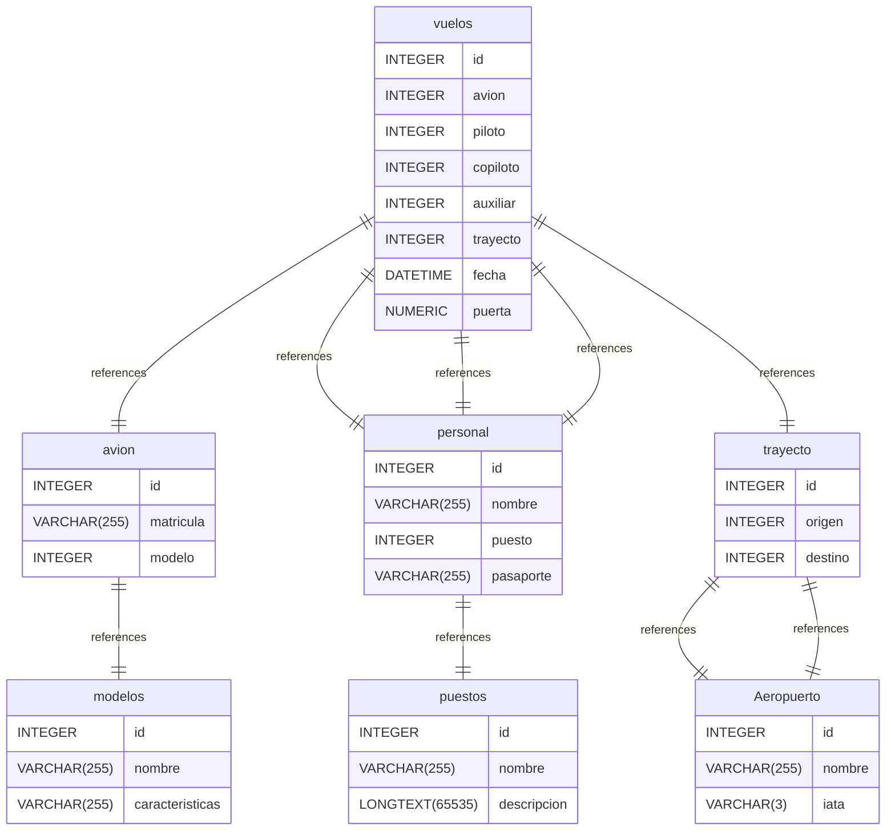

# Dreaming documentation
## Summary

- [Introduction](#introduction)
- [Database Type](#database-type)
- [Table Structure](#table-structure)
	- [avion](#avion)
	- [modelos](#modelos)
	- [vuelos](#vuelos)
	- [trayecto](#trayecto)
	- [Aeropuerto](#Aeropuerto)
	- [personal](#personal)
	- [puestos](#puestos)
- [Relationships](#relationships)
- [Database Diagram](#database-Diagram)

## Introduction

## Database type

- **Database system:** MySQL
## Table structure

### avion

| Name        | Type          | Settings                      | References                    | Note                           |
|-------------|---------------|-------------------------------|-------------------------------|--------------------------------|
| **id** | INTEGER | 🔑 PK, not null , unique, autoincrement |  | |
| **matricula** | VARCHAR(255) | not null  |  | |
| **modelo** | INTEGER | not null , unique | fk_avion_modelo_modelos | | 

#### Indexes
| Name | Unique | Fields |
|------|--------|--------|
| avion_index_0 |  |  |
### modelos

| Name        | Type          | Settings                      | References                    | Note                           |
|-------------|---------------|-------------------------------|-------------------------------|--------------------------------|
| **id** | INTEGER | 🔑 PK, not null , unique, autoincrement |  | |
| **nombre** | VARCHAR(255) | not null  |  | |
| **caracteristicas** | VARCHAR(255) | not null  |  | | 

### vuelos

| Name        | Type          | Settings                      | References                    | Note                           |
|-------------|---------------|-------------------------------|-------------------------------|--------------------------------|
| **id** | INTEGER | 🔑 PK, not null , unique, autoincrement |  | |
| **avion** | INTEGER | not null  | fk_vuelos_avion_avion | |
| **piloto** | INTEGER | not null  | fk_vuelos_piloto_personal | |
| **copiloto** | INTEGER | not null  | fk_vuelos_copiloto_personal | |
| **auxiliar ** | INTEGER | not null  | fk_vuelos_auxiliar _personal | |
| **trayecto** | INTEGER | not null  | fk_vuelos_trayecto_trayecto | |
| **fecha** | DATETIME | not null  |  | |
| **puerta ** | NUMERIC | not null  |  | | 

### trayecto

| Name        | Type          | Settings                      | References                    | Note                           |
|-------------|---------------|-------------------------------|-------------------------------|--------------------------------|
| **id** | INTEGER | 🔑 PK, not null , unique, autoincrement |  | |
| **origen** | INTEGER | not null  | fk_trayecto_origen_Aeropuerto | |
| **destino** | INTEGER | not null  | fk_trayecto_destino_Aeropuerto | | 

### Aeropuerto

| Name        | Type          | Settings                      | References                    | Note                           |
|-------------|---------------|-------------------------------|-------------------------------|--------------------------------|
| **id** | INTEGER | 🔑 PK, not null , unique, autoincrement |  | |
| **nombre** | VARCHAR(255) | not null  |  | |
| **iata** | VARCHAR(3) | not null  |  | | 

### personal

| Name        | Type          | Settings                      | References                    | Note                           |
|-------------|---------------|-------------------------------|-------------------------------|--------------------------------|
| **id** | INTEGER | 🔑 PK, not null , unique, autoincrement |  | |
| **nombre** | VARCHAR(255) | not null  |  | |
| **puesto** | INTEGER | not null  | fk_personal_puesto_puestos | |
| **pasaporte** | VARCHAR(255) | not null  |  | | 

### puestos

| Name        | Type          | Settings                      | References                    | Note                           |
|-------------|---------------|-------------------------------|-------------------------------|--------------------------------|
| **id** | INTEGER | 🔑 PK, not null , unique, autoincrement |  | |
| **nombre** | VARCHAR(255) | not null  |  | |
| **descripcion** | LONGTEXT(65535) | not null  |  | | 

## Relationships

- **avion to modelos**: one_to_one
- **trayecto to Aeropuerto**: one_to_one
- **trayecto to Aeropuerto**: one_to_one
- **personal to puestos**: one_to_one
- **vuelos to avion**: one_to_one
- **vuelos to personal**: one_to_one
- **vuelos to personal**: one_to_one
- **vuelos to personal**: one_to_one
- **vuelos to trayecto**: one_to_one

## Database Diagram

